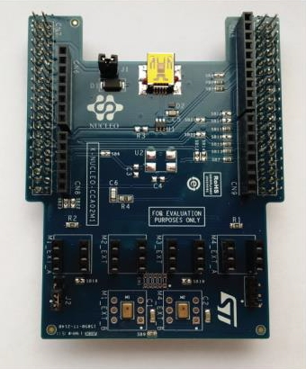

@if (DOXYGEN_PROJECT)
@defgroup X-NUCLEO-CCA02M1
@endif

# X-NUCLEO-CCA02M1 
### Introduction
The X-NUCLEO-CCA02M1 is an evaluation board based on digital MEMS microphones. It is compatible with the Morpho connector layout, and it's designed around STMicroelectronics MP34DT01-M digital microphones. It has two microphones soldered on board and it is compatible with digital microphone coupon boards such as STEVAL-MKI129Vx and STEVAL-MKI155Vx. The X-NUCLEO-CCA02M1 allows the acquisition and streaming of up to 2 microphones using the I²S peripheral and up 4 coupon microphones using both I²S and SPI. It represents an easy to use and fast solution for the development of microphone based application as well as a starting point for audio algorithm implementation.
 
### Key Features
- 2x MP34DT01-M Digital MEMS microphones on board
- 6 slots to plug digital microphone coupon boards such as STEVAL-MKI129Vx and STEVAL-MKI155Vx
- Up to 4 microphone synchronized acquisition and streaming
- Free comprehensive development firmware library and audio capture and USB streaming example application compatible with STM32Cube firmware
- Compatible with STM32 Nucleo boards
- Equipped with Morpho connector (upward and downward)
- Equipped with Arduino UNO R3 connector (upward) to allow multiple board application
- RoHS compliant

### Image

### DataSheet
	[Datasheet](./assets/pdf/MP34DT01-M_DS.pdf)

### Schematic
	[Schematic](./assets/pdf/x-nucleo-cca02m1_schematic.pdf)
	
### User Manual
	[Usermanual](./assets/pdf/x-nucleo-cca02m1_quick_start_guide.pdf)